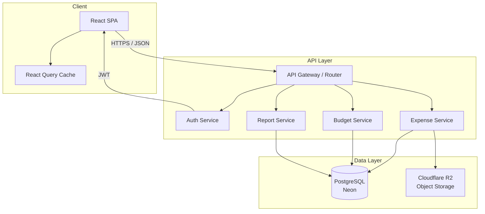
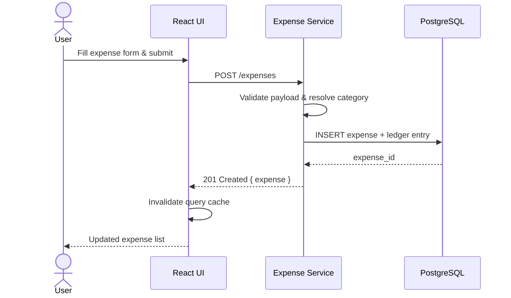
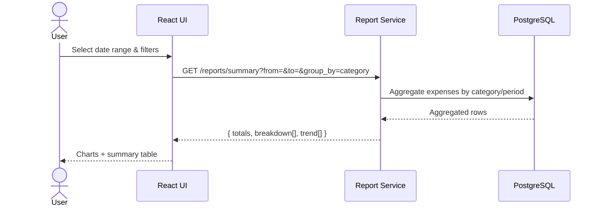

# Design Document: Ledgr — Expenses Management

## Overview

Ledgr is a personal expenses management application that enables a single user to track, categorize, and analyze their spending across categories and time periods. It supports real-time balance tracking, budget envelopes, and reporting — built around a clean, fast UI with offline-capable data entry.

The architecture follows a client-server model with a React frontend, a RESTful API backend, and a relational database. The design prioritizes data integrity, auditability (immutable ledger entries), and extensibility for future features like multi-user collaboration, receipt OCR, or bank sync — without over-engineering for them in v1.

**Deployment targets (zero cost for personal use)**:
- Frontend: Vercel (free tier)
- Backend: Railway or Render (free tier)
- Database: Neon (serverless PostgreSQL, free tier)
- File storage: Cloudflare R2 (free tier: 10 GB/month, no egress fees)

## Architecture



## Sequence Diagrams

### Add Expense Flow



### Monthly Report Flow



## Components and Interfaces

### Component: Expense Service

**Purpose**: Core CRUD for expense records; enforces business rules (e.g. no future-dated expenses beyond 7 days, amount > 0).

**Interface**:
```typescript
interface ExpenseService {
  createExpense(payload: CreateExpenseDTO): Promise<Expense>
  updateExpense(id: string, patch: UpdateExpenseDTO): Promise<Expense>
  deleteExpense(id: string): Promise<void>           // soft-delete only
  getExpense(id: string): Promise<Expense>
  listExpenses(filters: ExpenseFilters): Promise<PaginatedResult<Expense>>
}

interface CreateExpenseDTO {
  amount: number          // positive, in minor currency units (cents)
  currency: string        // ISO 4217
  date: string            // ISO 8601 date
  categoryId: string
  description?: string
  receiptUrl?: string
  // splitWith is reserved for future multi-user support — not exposed in v1 UI
}

interface ExpenseFilters {
  from?: string
  to?: string
  categoryIds?: string[]
  minAmount?: number
  maxAmount?: number
  page: number
  pageSize: number        // max 100
}
```

**Responsibilities**:
- Validate and persist expense records
- Emit ledger entries for every mutation (immutable audit trail)
- Handle receipt attachment references
- Split tracking reserved for future multi-user phase (schema supports it, UI does not expose it in v1)

---

### Component: Budget Service

**Purpose**: Manages budget envelopes per category/period and tracks spend against them.

**Interface**:
```typescript
interface BudgetService {
  createBudget(payload: CreateBudgetDTO): Promise<Budget>
  getBudgetStatus(budgetId: string): Promise<BudgetStatus>
  listBudgets(userId: string, period: YearMonth): Promise<Budget[]>
}

interface CreateBudgetDTO {
  categoryId: string
  limitAmount: number     // in minor currency units
  currency: string
  period: YearMonth       // { year: number, month: number }
  rollover: boolean       // carry unused budget to next period
}

interface BudgetStatus {
  budget: Budget
  spent: number
  remaining: number
  percentUsed: number
  isOverBudget: boolean
}
```

**Responsibilities**:
- Define spending limits per category and time period
- Compute real-time spend vs. limit
- Trigger alerts when threshold (e.g. 80%, 100%) is crossed

---

### Component: Report Service

**Purpose**: Aggregates expense data into summaries, trends, and breakdowns for display and export.

**Interface**:
```typescript
interface ReportService {
  getSummary(params: ReportParams): Promise<ReportSummary>
  getTrend(params: TrendParams): Promise<TrendPoint[]>
  exportCSV(params: ReportParams): Promise<ReadableStream>
}

interface ReportParams {
  userId: string
  from: string            // ISO 8601 date
  to: string
  groupBy: 'category' | 'day' | 'week' | 'month'
  categoryIds?: string[]
}

interface ReportSummary {
  totalSpent: number
  currency: string
  breakdown: CategoryBreakdown[]
  topExpenses: Expense[]
}
```

---

### Component: Auth Service

**Purpose**: Issues and validates JWT tokens; manages user sessions and permissions.

**Interface**:
```typescript
interface AuthService {
  login(credentials: Credentials): Promise<AuthTokens>
  refresh(refreshToken: string): Promise<AuthTokens>
  logout(userId: string): Promise<void>
  validateToken(token: string): Promise<TokenPayload>
}

interface AuthTokens {
  accessToken: string     // short-lived (15 min)
  refreshToken: string    // long-lived (30 days), stored httpOnly cookie
}
```

---

## Data Models

### Expense

```typescript
interface Expense {
  id: string              // UUID
  userId: string          // owner
  amount: number          // positive integer, minor currency units
  currency: string        // ISO 4217, e.g. "PHP"
  date: string            // ISO 8601 date (not datetime — avoids TZ issues)
  categoryId: string
  description: string | null
  receiptUrl: string | null
  splits: SplitEntry[]    // reserved for future multi-user support; empty array in v1
  deletedAt: string | null  // soft delete
  createdAt: string
  updatedAt: string
}

interface SplitEntry {
  userId: string
  amount: number          // their share in minor units
  settled: boolean
}
```

**Validation Rules**:
- `amount` must be > 0 and ≤ 999_999_99 (prevents absurd entries)
- `date` must not be more than 7 days in the future
- `currency` must be a valid ISO 4217 code
- `splits` must be empty in v1; reserved for future use

---

### Category

```typescript
interface Category {
  id: string
  userId: string | null   // null = system default category
  name: string            // max 50 chars
  icon: string            // emoji or icon identifier
  color: string           // hex color
  parentId: string | null // supports one level of nesting
  isArchived: boolean
}
```

**Validation Rules**:
- `name` is required, trimmed, max 50 chars
- `parentId` cannot reference another child (max depth = 2)
- System categories (`userId = null`) cannot be deleted

---

### Budget

```typescript
interface Budget {
  id: string
  userId: string
  categoryId: string
  limitAmount: number     // minor currency units
  currency: string
  year: number
  month: number           // 1–12
  rollover: boolean
  createdAt: string
}
```

**Validation Rules**:
- One budget per `(userId, categoryId, year, month)` — unique constraint
- `limitAmount` must be > 0
- `month` must be 1–12

---

### LedgerEntry (Audit Trail)

```typescript
interface LedgerEntry {
  id: string
  entityType: 'expense' | 'budget'  // 'split' reserved for future multi-user phase
  entityId: string
  action: 'create' | 'update' | 'delete'
  userId: string          // who performed the action
  diff: Record<string, unknown>  // before/after snapshot
  timestamp: string
}
```

**Validation Rules**:
- Immutable — no UPDATE or DELETE on this table
- `diff` stores only changed fields for updates

---

## Error Handling

### Validation Error (400)

**Condition**: Request payload fails schema or business rule validation.
**Response**: `{ error: "VALIDATION_ERROR", fields: { [field]: string } }`
**Recovery**: Client displays inline field errors; no retry needed.

### Unauthorized (401)

**Condition**: Missing or expired access token.
**Response**: `{ error: "UNAUTHORIZED" }`
**Recovery**: Client attempts token refresh; if refresh fails, redirects to login.

### Conflict (409)

**Condition**: Duplicate budget for same `(userId, categoryId, period)`.
**Response**: `{ error: "CONFLICT", message: "Budget already exists for this period" }`
**Recovery**: Client prompts user to edit the existing budget instead.

### Not Found (404)

**Condition**: Expense or resource ID does not exist or belongs to another user.
**Response**: `{ error: "NOT_FOUND" }`
**Recovery**: Client removes stale item from cache and refreshes list.

---

## Testing Strategy

### Unit Testing Approach

Test service-layer business logic in isolation (mocked DB):
- Amount validation edge cases (zero, negative, max)
- Split amount reconciliation
- Budget threshold calculations
- Date boundary rules (future date limit)

### Property-Based Testing Approach

**Property Test Library**: fast-check (TypeScript)

Key properties to verify:
- Budget `percentUsed` is always in `[0, ∞)` and `remaining = limit - spent`
- Soft-deleted expenses never appear in list/report queries
- Ledger entries are append-only: count only ever increases

### Integration Testing Approach

- Full request/response cycle against a test database
- Auth token issuance and refresh flow
- Report aggregation correctness against known seed data
- CSV export format validation

---

## Performance Considerations

- Expense list queries paginated (max 100/page); indexed on `(userId, date DESC)`
- Report aggregations run against indexed columns `(userId, date, categoryId)`; no caching layer needed at personal scale
- Ledger table is append-only; partitioning can be added later if data grows significantly
- Receipt files stored in Cloudflare R2 (not DB); only URLs stored in the expense record

---

## Security Considerations

- All amounts stored as integers (minor units) — no floating point to avoid rounding exploits
- Users can only read/write their own data; row-level security enforced at the DB layer
- Refresh tokens stored as httpOnly, Secure, SameSite=Strict cookies
- Receipt upload URLs are pre-signed with short expiry (15 min)
- Soft deletes only — no data is permanently destroyed without explicit admin action

---

## Correctness Properties

*A property is a characteristic or behavior that should hold true across all valid executions of a system — essentially, a formal statement about what the system should do. Properties serve as the bridge between human-readable specifications and machine-verifiable correctness guarantees.*

### Property 1: Expense creation round-trip

*For any* valid expense payload (varying amount, date, currency, category, description), creating an expense and then retrieving it by the returned ID should produce a record whose fields match the submitted payload exactly.

**Validates: Requirements 2.1, 2.2**

---

### Property 2: Amount stored as positive integer in minor units

*For any* valid expense or budget, the `amount` / `limitAmount` field stored in the database and returned by the API must be a positive integer with no floating-point representation.

**Validates: Requirements 2.2, 11.2**

---

### Property 3: Invalid amounts are rejected

*For any* amount value that is zero, negative, or greater than 999,999,99, submitting it as an expense amount must produce a 400 Validation Error with a structured `VALIDATION_ERROR` response body.

**Validates: Requirements 2.3, 10.1**

---

### Property 4: Future-date boundary enforcement

*For any* date that is more than 7 days after the current date, submitting it as an expense date must produce a 400 Validation Error.

**Validates: Requirements 2.4, 10.1**

---

### Property 5: Invalid currency codes are rejected

*For any* string that is not a valid ISO 4217 currency code, submitting it as an expense currency must produce a 400 Validation Error.

**Validates: Requirements 2.5, 10.1**

---

### Property 6: Soft-deleted expenses are universally excluded

*For any* expense that has been soft-deleted (non-null `deletedAt`), it must not appear in any list query result, report aggregation, trend data point, or CSV export — regardless of the filter parameters supplied.

**Validates: Requirements 3.4, 7.6**

---

### Property 7: User data isolation

*For any* two distinct users A and B, all API responses for user A (list, get, report, budget status) must contain only records owned by user A, and must return HTTP 404 for any attempt to access a record owned by user B by ID.

**Validates: Requirements 3.1, 7.5, 11.1, 11.3**

---

### Property 8: Filter correctness

*For any* set of expenses and any combination of filter parameters (date range, category IDs, min/max amount), every expense returned by the list endpoint must satisfy all supplied filter criteria, and no expense that satisfies all criteria must be omitted.

**Validates: Requirements 3.2**

---

### Property 9: Pagination size invariant

*For any* list request, the number of expenses in a single page of results must never exceed 100.

**Validates: Requirements 3.3**

---

### Property 10: Expense update round-trip

*For any* existing expense and any valid partial update payload, applying the update and then retrieving the expense by ID must return a record that reflects all patched fields while leaving unpatched fields unchanged.

**Validates: Requirements 4.1**

---

### Property 11: Soft-delete preserves row

*For any* expense that is soft-deleted, the underlying database row must still exist with a non-null `deletedAt` timestamp, and the total row count in the expenses table must not decrease.

**Validates: Requirements 4.4**

---

### Property 12: Category depth constraint

*For any* attempt to create a category with a `parentId` that itself has a non-null `parentId`, the request must be rejected with a 400 Validation Error.

**Validates: Requirements 5.3**

---

### Property 13: System categories are undeletable

*For any* category with `userId = null`, any delete request must be rejected with HTTP 403, regardless of the authenticated user.

**Validates: Requirements 5.4**

---

### Property 14: Budget arithmetic invariant

*For any* budget and any set of non-deleted expenses in the same category and period, the BudgetStatus response must satisfy: `remaining = limitAmount - spent`, `percentUsed = (spent / limitAmount) * 100`, `isOverBudget = (spent >= limitAmount)`, and the 80%-threshold indicator must be set when `percentUsed >= 80`.

**Validates: Requirements 6.5, 6.6, 6.7**

---

### Property 15: Budget uniqueness constraint

*For any* two budget creation requests with the same `(categoryId, year, month)` for the same user, the second request must produce HTTP 409 with `{ error: "CONFLICT" }`.

**Validates: Requirements 6.2**

---

### Property 16: Report grouping correctness

*For any* set of expenses and any `groupBy` value (`category`, `day`, `week`, `month`), every data point in the report response must aggregate only expenses that fall within the corresponding group boundary, with no expense counted in more than one group.

**Validates: Requirements 7.2, 7.3**

---

### Property 17: CSV export round-trip

*For any* set of expenses in a date range, exporting to CSV and then parsing the CSV back must produce a collection of records whose fields match the original expense data (amount, date, category, description).

**Validates: Requirements 7.4**

---

### Property 18: Ledger append-only invariant

*For any* sequence of create, update, and delete operations on expenses and budgets, the total count of LedgerEntry rows must increase by exactly 1 per operation and must never decrease. No UPDATE or DELETE statement may target the ledger table.

**Validates: Requirements 9.1, 9.2**

---

### Property 19: Ledger entry completeness

*For any* mutation (create, update, or delete) on an expense or budget, the resulting LedgerEntry must contain non-null values for `userId`, `entityType`, `entityId`, `action`, and `timestamp`.

**Validates: Requirements 9.4**

---

### Property 20: Ledger diff minimality

*For any* expense update with a known set of changed fields, the `diff` field of the resulting LedgerEntry must contain exactly the changed fields and must not include fields whose values were not modified.

**Validates: Requirements 9.3, 4.3**

---

### Property 21: Splits are always empty in v1

*For any* expense created or retrieved via the API in v1, the `splits` field must be an empty array.

**Validates: Requirements 11.4**

---

## Dependencies

| Dependency | Purpose |
|---|---|
| PostgreSQL (Neon) | Primary relational store — serverless, free tier |
| Cloudflare R2 | Receipt file storage — free tier, no egress fees |
| JWT library | Token issuance and validation |
| Zod | Runtime schema validation |
| React Query | Client-side server state and caching |
| Recharts | Expense trend and breakdown charts |
| fast-check | Property-based testing |
